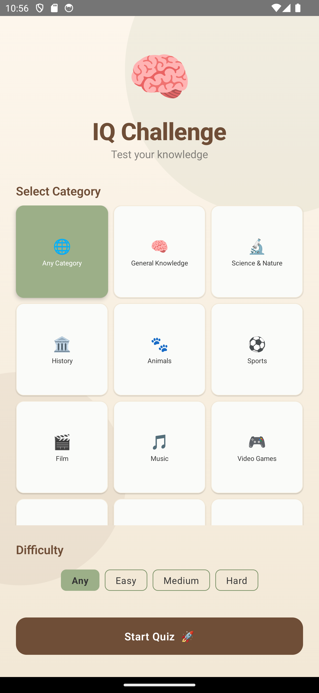
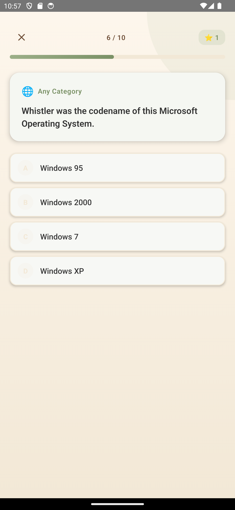
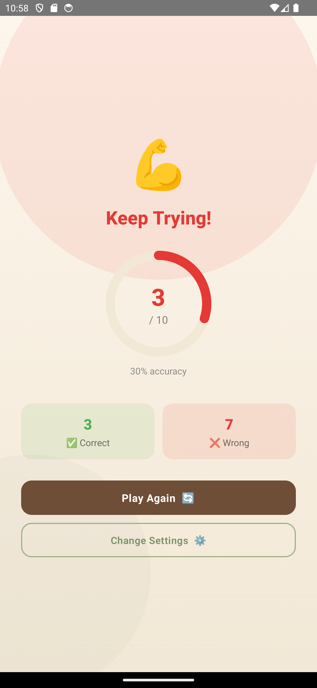

# IQ Challenge

**Kotlin Jetpack Compose — Android Mobile Application**
COMP-5450 Mobile Programming | Lakehead University | Department of Computer Science
Instructor: Dr. Sabah Mohammed

---

| Field | Details |
|---|---|
| **Group** | Group 5 |
| **Course** | COMP-5450 Mobile Programming |
| **Platform** | Android (Kotlin + Jetpack Compose) |
| **Min SDK** | API 26 (Android 8.0 Oreo) |
| **Target SDK** | API 34 |
| **Kotlin Version** | 1.9.10 |
| **Gradle Plugin** | 8.1.2 |
| **API Source** | [Open Trivia DB](https://opentdb.com) |

---

## 1. Project Overview

IQ Challenge is a fully featured trivia quiz application built with Kotlin and Jetpack Compose for Android. The app fetches live questions from the **Open Trivia DB API** and presents them with an eye-catching UI themed in Sage Green, Cream, Earthy Brown, and Dark Slate. Users select a category and difficulty before starting, answer multiple-choice questions with instant visual feedback, and receive an animated score summary at the end. All past scores are persisted locally via **Room**.

**Features implemented:**

- Home screen with 12 category tiles (emoji + name) and difficulty chip selector
- Animated pulsing brain logo and decorative background shapes
- Live question fetching from Open Trivia DB with HTML entity decoding
- Quiz screen with animated progress bar, A/B/C/D labelled option cards, and score badge
- Instant per-answer colour feedback (correct/wrong) with auto-advance after 1.2s
- Animated result screen with circular score ring, bounce emoji, and stat cards
- Score history stored in Room database, displayed as a leaderboard on the Home screen
- Smooth `AnimatedContent` slide transitions between all three screens
- Full HTML entity decoding for all API-returned strings

---

## 2. Screenshots

| Home Screen | Quiz Screen | Result Screen |
|:-----------:|:-----------:|:-------------:|
|  |  |  |
| Category grid, difficulty chips, Start Quiz button | Progress bar, question card, A/B/C/D option cards | Animated score ring, stat cards, action buttons |

---

## 3. Project Structure
IQTestApp/
app/
src/main/
AndroidManifest.xml
java/com/yash/iqtest/
MainActivity.kt              # Entry point, theme + animated nav
api/
QuizApi.kt                 # Retrofit interface (amount, category, difficulty)
RetrofitInstance.kt        # Retrofit singleton (opentdb.com)
database/
AppDatabase.kt             # Room database definition
ScoreDao.kt                # Insert + ordered SELECT
ScoreEntity.kt             # Score table entity
model/
Question.kt                # Question data class
QuizCategory.kt            # Category + difficulty models & lists
QuizResponse.kt            # API response wrapper
viewmodel/
QuizViewModel.kt           # AndroidViewModel, Screen/AnswerState enums
ui/
theme/
Theme.kt                 # IQTestTheme, brand colour palette
Typography.kt            # Custom IQTypography
screens/
HomeScreen.kt            # Category grid, difficulty chips, history
QuizScreen.kt            # Progress bar, option cards, feedback
ResultScreen.kt          # Ring chart, stat cards, action buttons
res/
values/
strings.xml
themes.xml
app/build.gradle                   # Compose BOM, Room, Retrofit, KSP
build.gradle
settings.gradle
gradle.properties

---

## 4. Setup & Installation

### Requirements

- Android Studio Hedgehog (2023.1.1) or later
- JDK 17 or later
- Android SDK with API 34 platform installed
- Gradle 8.x (included via wrapper — no separate installation needed)
- Internet connection for first Gradle sync and for fetching quiz questions

### Dependencies

| Library | Version | Purpose |
|---|---|---|
| androidx.compose (BOM) | 2023.10.01 | All Compose UI libraries |
| androidx.compose.material3 | via BOM | Material 3 UI components |
| androidx.activity:activity-compose | 1.8.0 | Compose activity integration |
| androidx.lifecycle:lifecycle-viewmodel-compose | 2.6.2 | ViewModel in Compose |
| androidx.room:room-runtime | 2.6.0 | Local score persistence |
| com.squareup.retrofit2:retrofit | 2.9.0 | HTTP client for Open Trivia DB |
| com.squareup.retrofit2:converter-gson | 2.9.0 | JSON deserialisation |
| com.google.devtools.ksp | 1.9.10-1.0.13 | Room annotation processing |
| Kotlin | 1.9.10 | Programming language |
| Android Gradle Plugin | 8.1.2 | Build system |

### Steps

**Step 1 — Unzip the Project**
Unzip `IQTestApp_Complete.zip` to a folder of your choice. The project root is the `IQTestApp/` folder inside the archive.

**Step 2 — Open in Android Studio**
Launch Android Studio and select *File → Open*, then navigate to and select the `IQTestApp/` folder. Android Studio will recognise it as a Gradle project automatically.

**Step 3 — Wait for Gradle Sync**
Android Studio will automatically sync Gradle and download all dependencies. This requires an internet connection on the first run. Wait until the bottom status bar shows "Gradle sync finished" before proceeding.

**Step 4 — Create an Emulator or Connect a Device**
Go to *Tools → Device Manager → Create Virtual Device*. Choose Pixel 6 (or any device profile supporting API 26 or higher). Select API 34 as the system image and click Finish. Alternatively, connect a physical Android device with USB debugging enabled in developer options.

**Step 5 — Run the App**
Click the green Run button in the toolbar, or press **Shift + F10**. Select your emulator or device from the deployment target list. The app will build, install, and launch automatically.

**Step 6 — Navigate the App**
The app launches on the **Home** screen. Select a category tile, choose a difficulty chip, and tap *Start Quiz*. Answer each multiple-choice question — the correct answer highlights green and the wrong one red, then the next question loads automatically after 1.2 seconds. After all questions, the animated **Result** screen shows your score ring, accuracy percentage, and stat cards. Tap *Play Again* to retry or *Change Settings* to return to the Home screen.

---

## 5. Technical Notes

**Open Trivia DB integration.**
Questions are fetched via Retrofit from `https://opentdb.com/api.php` with optional `category` and `difficulty` query parameters. All returned strings pass through `Html.fromHtml()` to decode HTML entities (e.g. `&quot;`, `&amp;`) before display.

**Answer feedback & auto-advance.**
When the user taps an option, `AnswerState` transitions to `CORRECT` or `WRONG`, immediately recolouring option cards and showing a bottom banner. A `Handler(Looper.getMainLooper())` posts the advance call 1,200ms later, giving the user time to see the correct answer before the next question loads.

**Room score persistence.**
`QuizViewModel` extends `AndroidViewModel` to hold a Room database reference. After each quiz, the final score is inserted via `ScoreDao` and the history list is reloaded. The Home screen displays the five most recent scores, ordered newest-first, with gold/silver/bronze medals.

**Navigation approach.**
A `Screen` enum (`HOME`, `QUIZ`, `RESULT`) held in `mutableStateOf` drives navigation through `AnimatedContent` with horizontal slide + fade transitions, avoiding the need for NavHost and serialisable route arguments.

**State management.**
All UI state lives in `QuizViewModel` as `mutableStateOf` properties, observed directly in composables. This ensures correct recomposition on every state change with no additional `collectAsState` wrappers required.

**HTML entity decoding.**
Open Trivia DB encodes special characters as HTML entities. `Html.fromHtml(raw, Html.FROM_HTML_MODE_LEGACY)` is applied to every `question`, `correct_answer`, and each `incorrect_answers` entry immediately after the API response is received, so raw entities never reach the UI layer.

---
